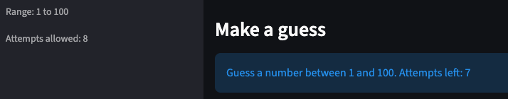
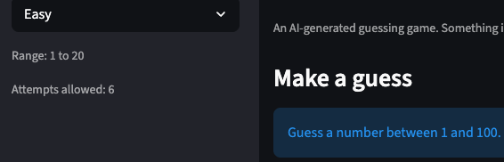
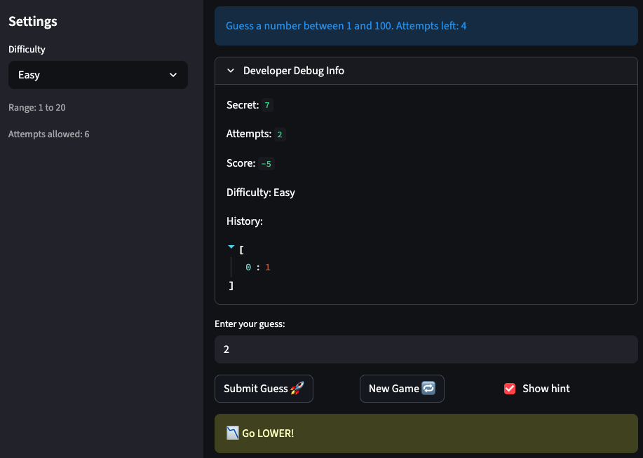
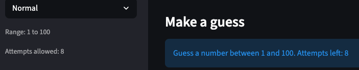
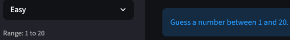
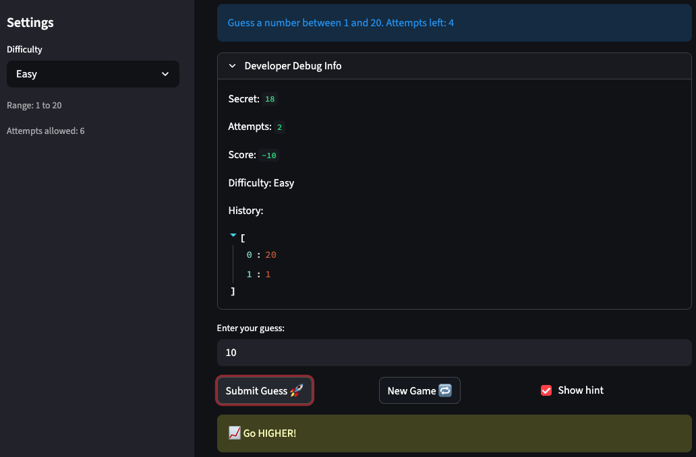
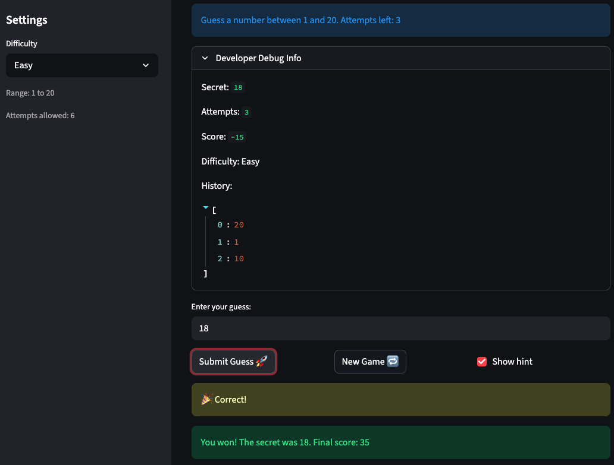
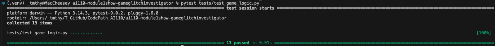

# 🎮 Game Glitch Investigator: The Impossible Guesser

## 🚨 The Situation

You asked an AI to build a simple "Number Guessing Game" using Streamlit.
It wrote the code, ran away, and now the game is unplayable.

- You can't win.
- The hints lie to you.
- The secret number seems to have commitment issues.

## 🛠️ Setup

1. Install dependencies: `pip install -r requirements.txt`
2. Run the broken app: `python -m streamlit run app.py`

## 🕵️‍♂️ Your Mission

1. **Play the game.** Open the "Developer Debug Info" tab in the app to see the secret number. Try to win.
2. **Find the State Bug.** Why does the secret number change every time you click "Submit"? Ask ChatGPT: _"How do I keep a variable from resetting in Streamlit when I click a button?"_
3. **Fix the Logic.** The hints ("Higher/Lower") are wrong. Fix them.
4. **Refactor & Test.** - Move the logic into `logic_utils.py`.
   - Run `pytest` in your terminal.
   - Keep fixing until all tests pass!

## 📝 Document Your Experience

- [x] Describe the game's purpose.

      This is a Number Guessing Game built with Streamlit. The player picks a difficulty (Easy/Normal/Hard, each mode changes the number range and the attempt limit), and the app generates a secret random number within a range. The player guesses a secret number within that range, has the option to receive "higher/lower" hints, and tries to find the secret number within a limited number of attempts. And a score is tracked based on performance.

- [x] Detail which bugs you found.
  1.  Bug 1: Attempt Count

      First bug is that the "Attempts left" showing on the info bar below the subtitle "Make a guess" is 1 less than the "Attempts allowed" shown on the left pane settings. The expected behavior is that "Attempts left" should match "Attempts allowed", which means that the game should start with full attempts and usually count only when actual guesses made. The code-level cause for this bug is the immediate initialization to 1 in app.py in line 96.

      

  2.  Bug 2: Number Range

      Second bug is that the game/the info bar display always says "between 1 and 100" regardless of changing the difficulty settings. The expected behavior is that the main UI info bar display should reflect the actual low/high values for selected difficulty. The code-level cause for this bug is the hardcoded st.info in app.py in line 110.

      

  3.  Bug 3: Guess Hint

      Third bug is that the hint directions are reversed. A high guess returns "Too High" but message says "Go HIGHER!"; low guess says "Go LOWER!". This leads the player in the wrong direction. The expected behavior is that high guess should say go lower; low guess should say go higher. The code-level cause for this bug is the reversed logic in app.py from line 37 to 40.

      

- [x] Explain what fixes you applied.
  1.  Fixed Bug 1: Attempt Count

      Changed the initialization from 1 to 0. This is correct because no guesses have been made yet when the session starts. The counter is incremented (+= 1) on each submit, so starting at 0 means the first guess correctly results in attempts == 1, and the player gets the full allotment of guesses.

      

  2.  Fixed Bug 2: Number Range

      Replaced the hardcoded 1 and 100 with {low} and {high}, the variables already computed on line 32 via get_range_for_difficulty(difficulty). Now the displayed range always matches the actual game range for the selected difficulty.

      

  3.  Fixed Bug 3: Guess Hint

      Swapped the messages in both branches: guess > secret -> "Too High", "📉 Go LOWER!" (guide player down toward the secret), guess < secret -> "Too Low", "📈 Go HIGHER!" (guide player up toward the secret). The outcome labels ("Too High" / "Too Low") were already correct, only the directional hint text was wrong.

      

## 📸 Demo

- [x] [Insert a screenshot of your fixed, winning game here]

  

## 🚀 Stretch Features

- [x] Challenge 1: Advanced Edge-Case Testing

  
